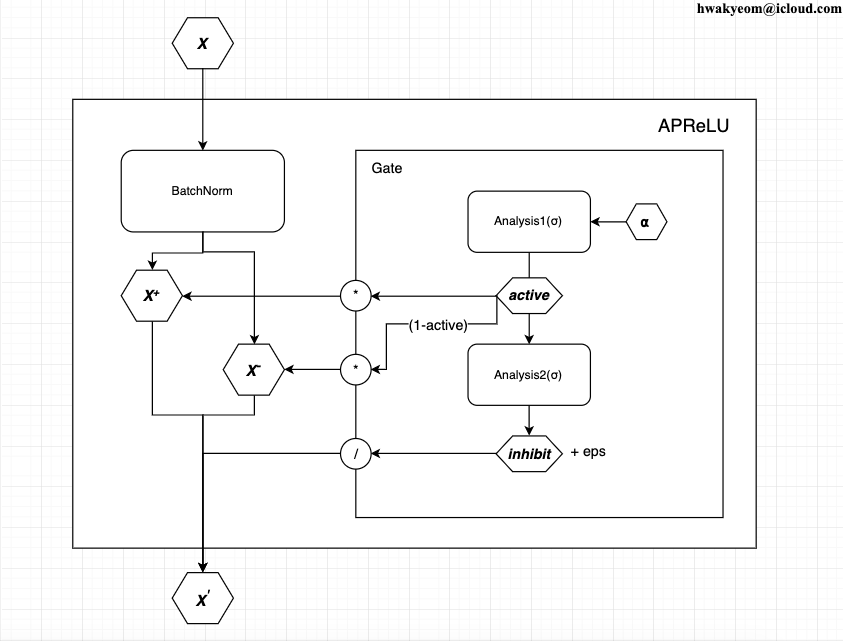
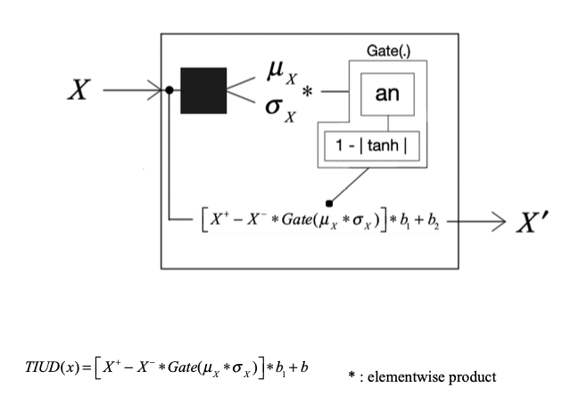
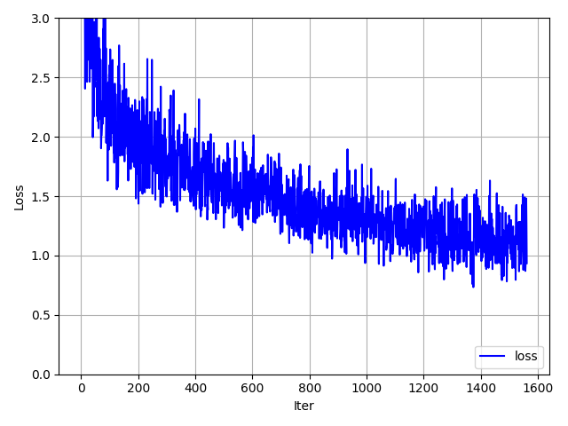
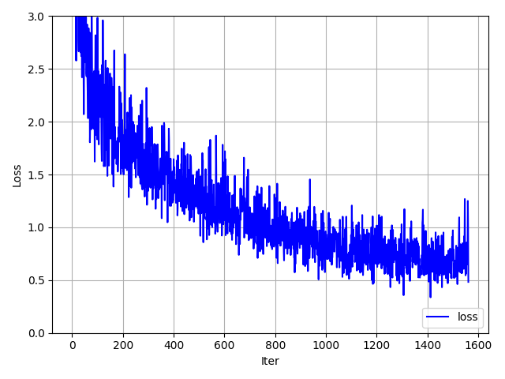
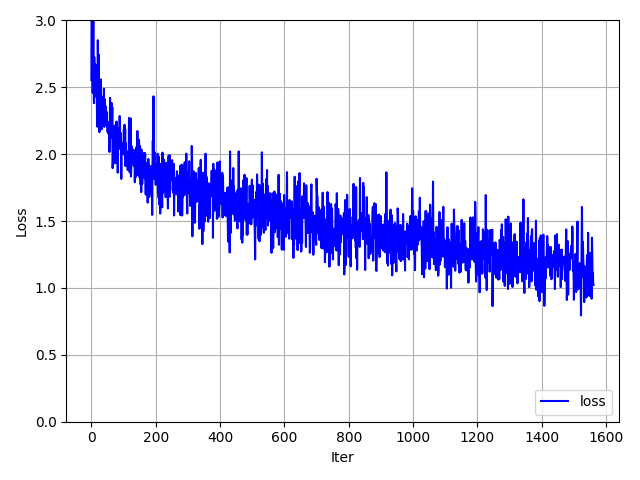
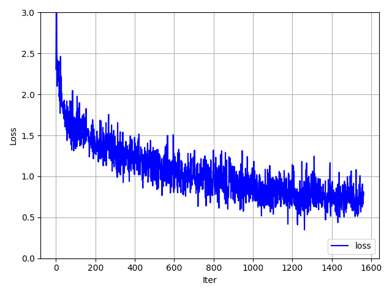

## **_TIUD_**(*T*uning *I*nput *U*nit from *D*istribution)

- It is my personal old side project and i don't work with it anymore.
- It is about new type of activation function in the deep neural network.
- I just posted it to show my history(What i did).
- (6. 11. 2019 ~ 11. 6. 2019)

---

## The evolution

- APReLU -> TIUD -> ...

  - APReLU Architecture
    

  - TIUD Architecture
    

---

## The performance

- **_`Inception Model`_**

  - ReLU

    

  - TIUD

    

- **_`Resnet Model`_**

  - ReLU

    

  - TIUD

    

 

## License

ⓒ 2019 All rights reserved by Hwakyeom Kim
